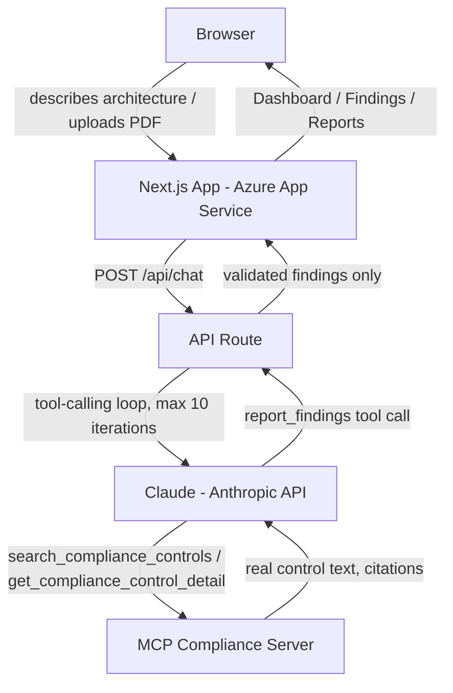

# SecureArch — AI Security Architect Assistant

An AI-powered security architecture review tool. Describe a cloud or software architecture — or upload a PDF describing one — and SecureArch analyzes it against real, live compliance controls (NIST 800-53, HIPAA, SOC 2, ISO 42001, EU AI Act, OWASP, MITRE, and more), returning specific findings, severities, and concrete remediation steps.

> Educational security assessment tool — not a substitute for a professional security review, penetration test, or compliance audit.

**Live app:** [ai-security-architect-b5gdgtegf3avbabj.westus3-01.azurewebsites.net](https://ai-security-architect-b5gdgtegf3avbabj.westus3-01.azurewebsites.net)

---

## What it does

- Describe an architecture in plain text, or upload a PDF, and get back structured findings: which component is affected, what's actually wrong, and how to fix it
- Every finding is grounded in a real, cited control from a live compliance-framework MCP server — not generated from general model knowledge
- Dashboard view ranks findings by severity ("What's exposed")
- Full Findings and Reports views, with print-to-PDF report generation
- A live chat panel for follow-up questions and control lookups

## Tech stack

- **Frontend/Backend:** Next.js 15 (App Router), React, TypeScript
- **Model:** Claude (Anthropic API), with tool-calling
- **Compliance data:** a remote MCP (Model Context Protocol) server, queried live via tool calls
- **Hosting:** Azure App Service (Linux, Node 24), deployed via Next.js standalone output
- **CI/CD:** GitHub Actions — build, dependency audit, automated security testing, and deploy

## Architecture



All MCP tool calls are **read-only** — the model can search and retrieve compliance control data, but nothing in this pipeline writes, deletes, or modifies any real system. See [`SECURITY.md`](./SECURITY.md) for the full security review.

## Getting started locally

**Prerequisites:** Node 24.x, an Anthropic API key, and access to a compatible MCP compliance server.

```bash
git clone https://github.com/TanStegall/ai-security-architect-assistant.git
cd ai-security-architect-assistant
npm install
```

Create a `.env.local` file in the project root:

```
ANTHROPIC_API_KEY=your-key-here
KYORA_MCP_TOKEN=your-mcp-token-here
```

Then run the dev server:

```bash
npm run dev
```

Open [http://localhost:3000](http://localhost:3000).

## Deployment

This app deploys to Azure App Service using Next.js's `standalone` output mode (a lean, self-contained build with its own minimal `node_modules`, avoiding the deployment issues that come with shipping a full `node_modules` tree). The GitHub Actions workflow:

1. `npm ci` — deterministic install
2. `npm audit --audit-level=high` — fails the build on high/critical dependency vulnerabilities
3. `npm run build` — produces the standalone output
4. **Starts the built app and runs the automated prompt-injection test suite against it live** — deployment is blocked if the security test fails
5. Assembles the lean standalone package and deploys to Azure via OIDC federated login (no long-lived Azure credentials stored anywhere)

Dependabot runs weekly to flag outdated npm packages and GitHub Actions versions.

## Security

This project has a full, honest, documented security review covering input handling, output validation, model-level defenses, infrastructure, and agentic/tool-calling risk — mapped against the OWASP Top 10 for LLM Applications (2026), the OWASP Top 10 for Agentic Applications (2026), and the NIST AI Risk Management Framework.

**See [`SECURITY.md`](./SECURITY.md) for the complete mapping**, including what's covered, what's explicitly out of scope for a portfolio-scale deployment, and why.

The prompt-injection defense specifically is backed by a real automated test (`test-injection.ts`) that fires actual attack payloads at the live app and verifies the model doesn't comply — this now runs on every single deploy as a CI gate, not just on request.

## Project background

For the story behind this project — the technical decisions, what broke and how it got fixed, and what I'd do differently — see [`PROJECT.md`](./PROJECT.md).

## License

This project is available for educational and portfolio purposes.
   
